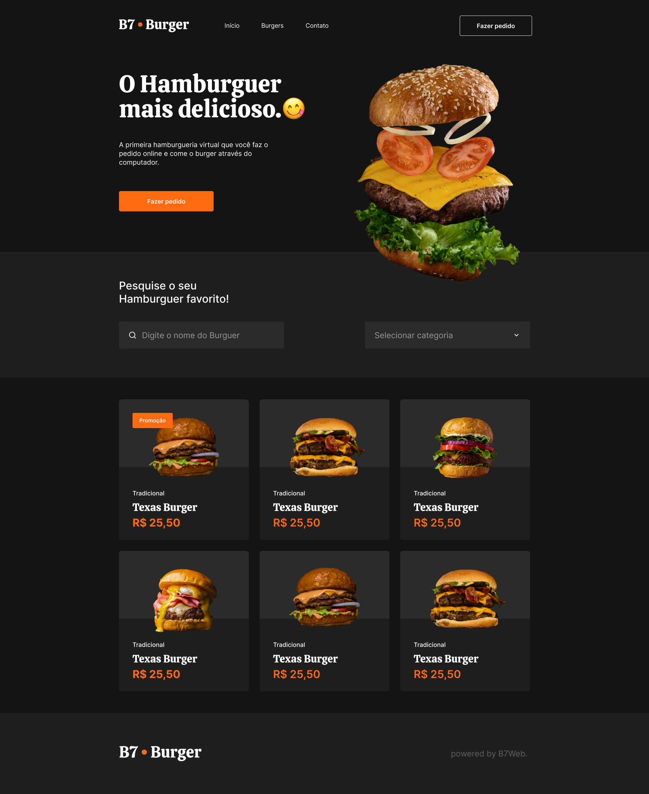

<h1 align="center"> B7Burger </h1>

Template desenvolvido no curso B7WEB Fullstack para aprimorar habilidades com CSS Grid  
este módulo do curso tinha o objetivo apenas de replicar um template pronto utilizando CSS grid e flexbox  

  <a href="#-template">Template</a>&nbsp;&nbsp;&nbsp;|&nbsp;&nbsp;&nbsp;
  <a href="#-tecnologias">Tecnologias</a>&nbsp;&nbsp;&nbsp;|&nbsp;&nbsp;&nbsp;
  <a href="#-projeto">Projeto</a>

 

    Abaixo o template completo qual foi baseada a codificação dessa página
  

## 🚀 Tecnologias

Esse projeto foi desenvolvido com as seguintes tecnologias:

- HTML e CSS
- Git e Github

## 💻 Projeto

O projeto apresenta um template responsivo utilizando HTML e CSS apenas para fins didaticos.

- [Acesse o projeto finalizado, online](https://albertmagnus011.github.io/b7burger/)

---

Feito com ♥ by Marcos da Silva
